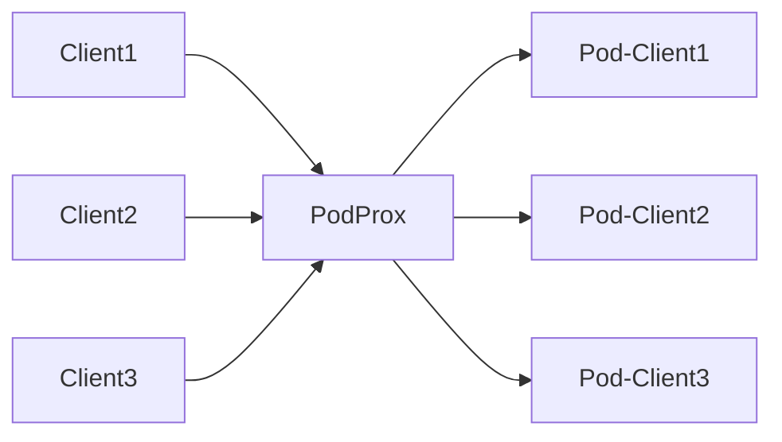

# PodProx

**Create a new Kubernetes pod for every new TCP connection and proxy the traffic**

## Example Usage
``` bash
# Store remote pod configuration in configmap
kubectl create configmap remote-manifest --from-file=examples/remote.yaml
# Deploy podprox
kubectl apply -f k8s/podprox.yaml
```

## Architecture

